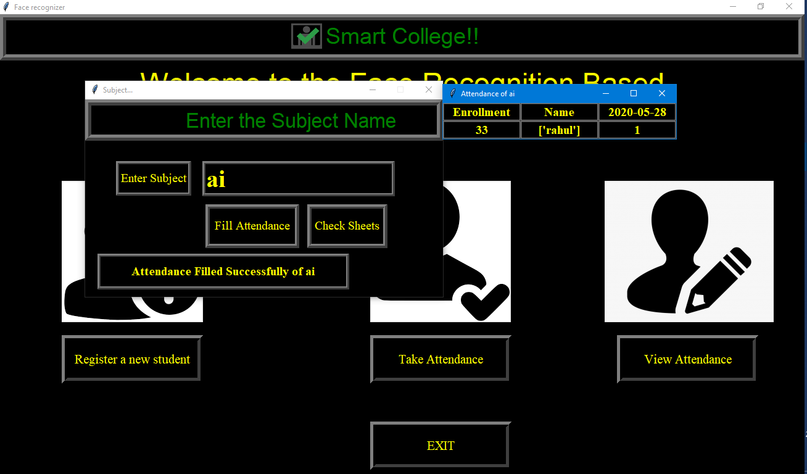

# face-recognized-attendance-system
attendance system using face recognization in Python

• Our Face Recognition Attendance System revolutionizes traditional attendance tracking methods. Powered by advanced facial recognition technology, this Python-based solution offers swift and accurate attendance management. Say goodbye to manual processes and hello to an efficient, secure, and automated system that simplifies the way organizations and institutions track attendance.

• future of attendance tracking! Our Face Recognition Attendance System, crafted in Python, ensures seamless and error-free attendance management. With rapid facial recognition, it brings efficiency and security to the forefront of the process.

### Problem Statement :
• Traditional methods of attendance tracking, such as manual registers or card-based systems, are prone to errors, time-consuming, and lack efficiency. These outdated systems often lead to inaccuracies, making it challenging for organizations to maintain precise records of attendance. Additionally, they are susceptible to buddy punching and can be inconvenient for both students and employees.

### Oppurtunity :
• The Face Recognition Attendance System addresses these challenges by leveraging advanced facial recognition technology. It provides a reliable and efficient solution to automate the attendance tracking process, reducing the likelihood of errors and enhancing overall accuracy. This technology not only streamlines administrative tasks but also offers a more secure and user-friendly experience for individuals. 

# Home Page :

## Project Modules :

# Other Snaps :

## SYSTEM REQUIREMENT:

### Hardware :
1. High-resolution camera
2. Modern processor (dual-core or higher)
3. Minimum 4GB RAM

### Software :
1. Compatible OS (Windows, Linux, macOS)
2. Python (version 3.x)
3. Required libraries (e.g., OpenCV, Dlib)
4. Facial recognition model (e.g., OpenFace, FaceNet)

### Database :
1. Database Management System (e.g., SQLite, MySQL)
2. Database connectivity

### User Interface : 
1. Graphical User Interface toolkit (e.g., Tkinter, PyQt)

### Connectivity : 
1. Internet connectivity (for optional cloud integration)

## Conclusion:
In wrapping up, our Face Recognition Attendance System is a smart and efficient way to take attendance. By using a good camera and clever computer programs, we make sure it's quick, accurate, and secure. No more hassle with papers or cards – just a modern system that makes attendance easy for everyone.

# Thank You    !
